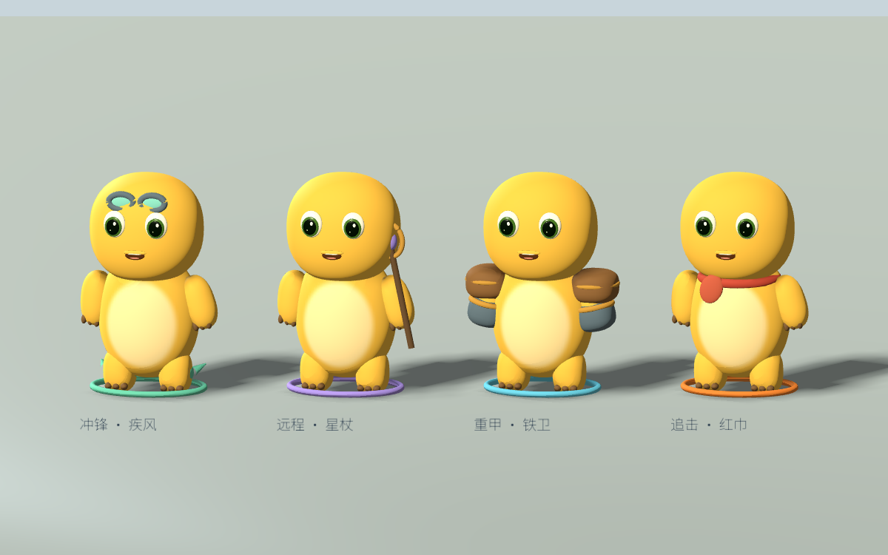
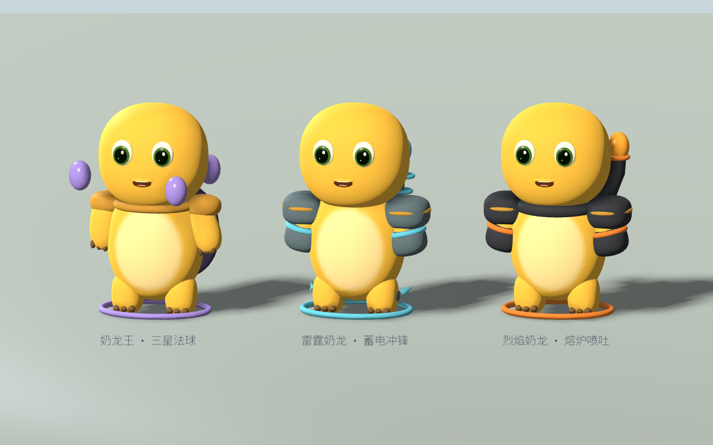

# 零点 / ZERO HOUR

十分钟超能力生存游戏 · 0.3.2 好友试玩版

**[点击这里下载游戏](https://github.com/YvesZhou-hub/zero-hour-releases/releases/tag/v0.3.2)**

这是需要下载安装的桌面游戏，不能在 GitHub 网页中直接游玩。无需游戏账号，没有付费功能或联网玩法。

| 电脑 | 下载文件 | 验证情况 |
| --- | --- | --- |
| Mac | `ZeroHour-0.3.2-macOS.zip` | Apple M4 / macOS 26.5 已实测；Intel 未实测 |
| Windows 64 位 | `ZeroHour-0.3.2-Windows-UNTESTED.zip` | 已导出，尚未在 Windows 实机运行 |

下载后解压，Mac 打开 `.app`，Windows 打开 `.exe`。Mac 包未公证，Windows 包未做发行签名；首次下载可能被系统拦截。请保留系统安全检查，仅在确认来源后使用系统提供的逐应用打开选项，不需要关闭全局保护。

## 怎么玩

WASD / 方向键移动，自动攻击；空格闪避，E 爆发，ESC 暂停，M 静音。设置支持中英切换、音量、画质、减少特效和按键重映射。

选择一个初始能力，收集能量升级。每局最多两系能力，两系分别达到 II 级会解锁融合。靠近已解锁的稳定锚累计充能八秒，完成三个稳定锚、击败约 2:30、5:30、8:30 登场的三只奶龙首领，并坚持至少十分钟后撤离。首领尚未击败时战斗会继续。

## 0.3.2 新内容

- 四类奶龙小怪：红巾追击、铁卫重甲、星杖远程、疾风冲锋。
- 三类 Boss：熔炉烈焰、蓄电雷霆、三星奶龙王；具备喷吐、冲锋、弹幕和坍缩预警。
- 强化敌潮和首领，最终奶龙王生命 3400；重做基础模型及装备动作。

下图是引擎内角色排阵预览，为比较装备统一展示尺寸；实际 Boss 更大。

## 试玩范围

首关、三种融合、敌潮、三类首领、胜败重玩和本地存档已经实现。角色动画与场景仍在打磨；难度与教学等待真人反馈。实体手柄、多分辨率及 Windows 兼容性仍待验证。这不是商业正式版。

欢迎在 Issues 留下电脑型号、系统版本、出现问题的步骤，以及卡顿、难度和操作反馈；截图请避免包含个人信息。

奶龙造型为参考重建的非官方同人模型；本项目与原角色权利方无官方关联，未取得官方角色商业授权。

游戏使用 Godot 与 Noto Sans SC，相关第三方许可已随游戏打包并可在制作页查看。标题插画由 AI 生成，代码、美术和音频制作使用了 AI 辅助。此仓库用于分发试玩包，不授予游戏素材的开放源码许可。
